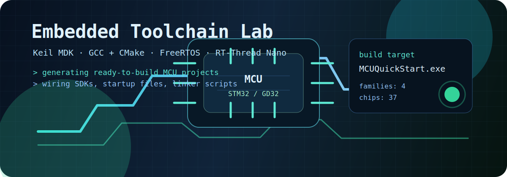

# Majie

**Embedded software developer building STM32 / GD32 tools**

## About

I focus on embedded software development around **STM32 / GD32**, **ARM Cortex-M**, **Keil MDK**, **GCC + CMake**, and small RTOS-based MCU projects.

Lately I have been working on small embedded tooling around project setup, RTOS templates, and build-system glue.

**Reach me at:** [mjie51939@gmail.com](mailto:mjie51939@gmail.com)

## What I Build

| Area | Details |
| --- | --- |
| MCU project generators | Keil MDK scaffolding, CMake output, startup files, linker scripts |
| RTOS-ready templates | FreeRTOS, RT-Thread Nano, SysTick and delay adaptation |
| Chip support | STM32F10x, STM32F4xx, GD32F10x, GD32F4xx |
| Desktop tooling | Python, PyQt6, SDK extraction, project configuration UI |

## Current Work

Mostly embedded tooling and project scaffolding. One of the tools is [MCUQuickStart](https://github.com/Majie-xixi/MCUQuickStart), a STM32/GD32 project generator.

## Contribution Snake

<picture>
  <source media="(prefers-color-scheme: dark)" srcset="snake/github-contribution-grid-snake-dark.svg">
  <source media="(prefers-color-scheme: light)" srcset="snake/github-contribution-grid-snake.svg">
  
</picture>

Building small tools that save setup time and make embedded development smoother.

