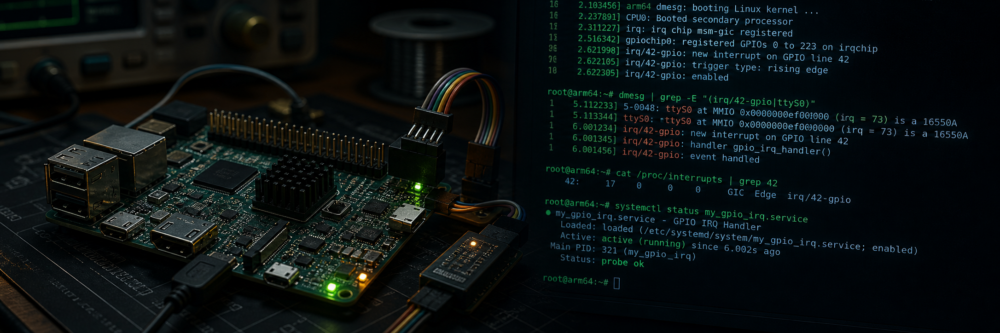
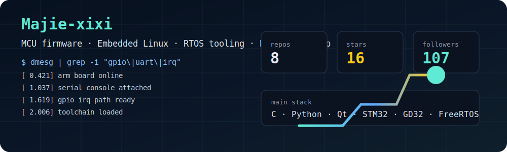

# Majie

**MCU firmware · Embedded Linux · Board bring-up · RTOS tooling**

## About

I work close to the hardware: **MCU firmware**, **embedded Linux**, **ARM boards**, **RTOS integration**, serial debugging, build systems, and small tools that make bring-up less painful.

I like the part where software meets real signals: GPIO, UART logs, startup files, linker scripts, interrupt paths, SDK layouts, and board-specific details that decide whether a project boots cleanly.

**Reach me at:** [mjie51939@gmail.com](mailto:mjie51939@gmail.com)

## Technologies

)

## Embedded Direction

- MCU firmware around STM32 / GD32, startup code, linker scripts, peripherals, and RTOS timing.
- Embedded Linux bring-up around ARM boards, serial console, GPIO interrupts, and debug traces.
- Desktop utilities and project scaffolding tools that reduce repetitive setup work.

## Statistics

## Current Work

Mostly embedded tooling and project setup experiments. One small example is [MCUQuickStart](https://github.com/Majie-xixi/MCUQuickStart), a STM32/GD32 project generator.

## Contribution Snake

<picture>
  <source media="(prefers-color-scheme: dark)" srcset="snake/github-contribution-grid-snake-dark.svg">
  <source media="(prefers-color-scheme: light)" srcset="snake/github-contribution-grid-snake.svg">
  
</picture>
