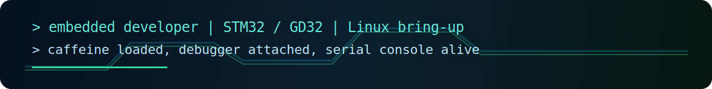

<div align="center">

# Majie

**Embedded software developer focused on MCU and embedded Linux**





</div>

## About

I work close to the hardware: **MCU firmware**, **embedded Linux**, **ARM boards**, **RTOS integration**, serial debugging, build systems, and the small tools that make bring-up less painful.

I like the part where software meets real signals: GPIO, UART logs, startup files, linker scripts, interrupt paths, SDK layouts, and board-specific details that decide whether a project boots cleanly.

**Reach me at:** [mjie51939@gmail.com](mailto:mjie51939@gmail.com)

## Focus

| Area | What I care about |
| --- | --- |
| Embedded Linux | board bring-up, serial console, GPIO / IRQ debug, driver-facing workflows |
| MCU firmware | STM32 / GD32, ARM Cortex-M, startup code, linker scripts, peripheral templates |
| RTOS work | FreeRTOS, RT-Thread Nano, SysTick and delay adaptation |
| Tooling | C, Python, PyQt6, Keil MDK, GCC, CMake, project scaffolding |

## Lab Notes

```text
$ dmesg | grep -i "gpio\|irq\|uart"
[    0.421] arm64 board online
[    1.037] ttyS0: serial console attached
[    1.284] gpiochip0: registered 96 lines
[    1.619] irq/42-gpio: edge interrupt ready
[    2.006] userland: caffeine loaded, debugger attached
```

## Working Range

| Layer | Tools / Topics |
| --- | --- |
| Board | ARM SBCs, MCU dev boards, UART adapters, GPIO headers |
| Kernel-facing | interrupts, serial logs, device bring-up, debug traces |
| Firmware | startup files, linker scripts, peripheral init, RTOS timing |
| Application tools | Python utilities, PyQt6 desktop tools, project generators |

## Current Work

Mostly embedded tooling and project setup experiments. One small example is [MCUQuickStart](https://github.com/Majie-xixi/MCUQuickStart), a STM32/GD32 project generator.

## Contribution Snake

<picture>
  <source media="(prefers-color-scheme: dark)" srcset="snake/github-contribution-grid-snake-dark.svg">
  <source media="(prefers-color-scheme: light)" srcset="snake/github-contribution-grid-snake.svg">
  
</picture>
